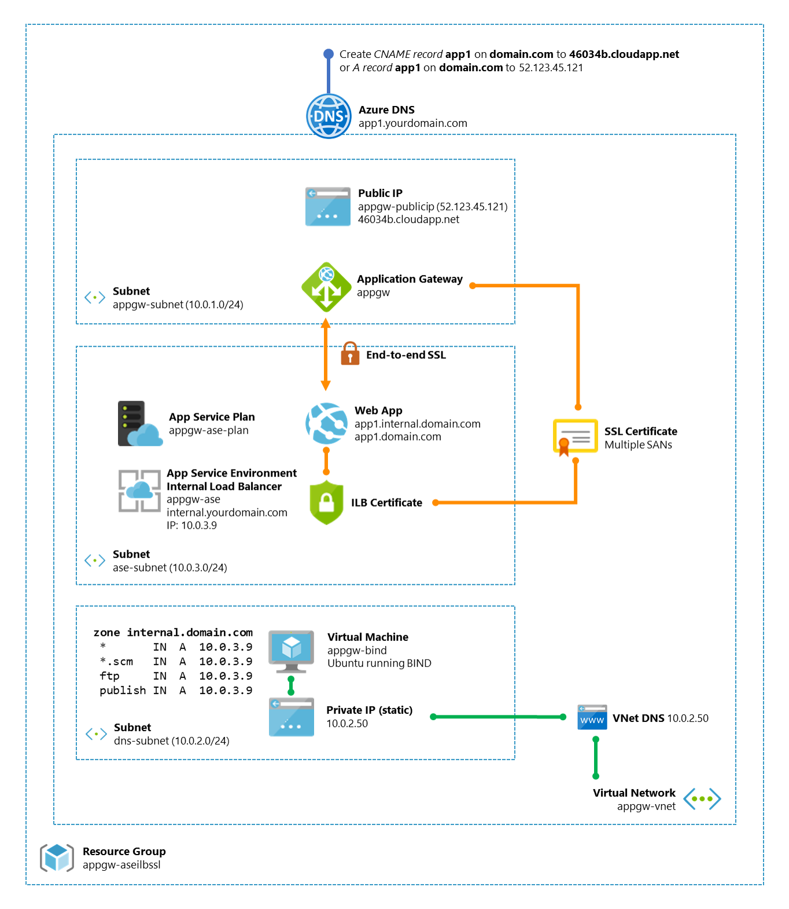
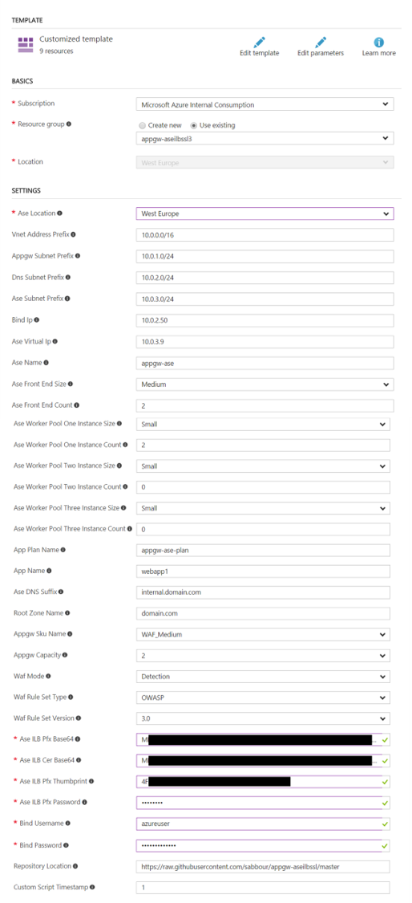
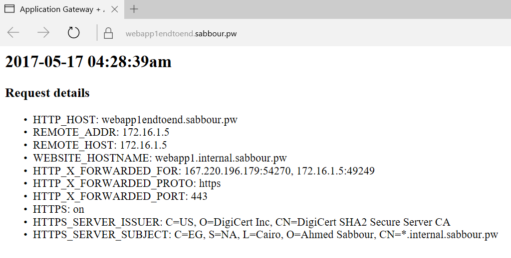
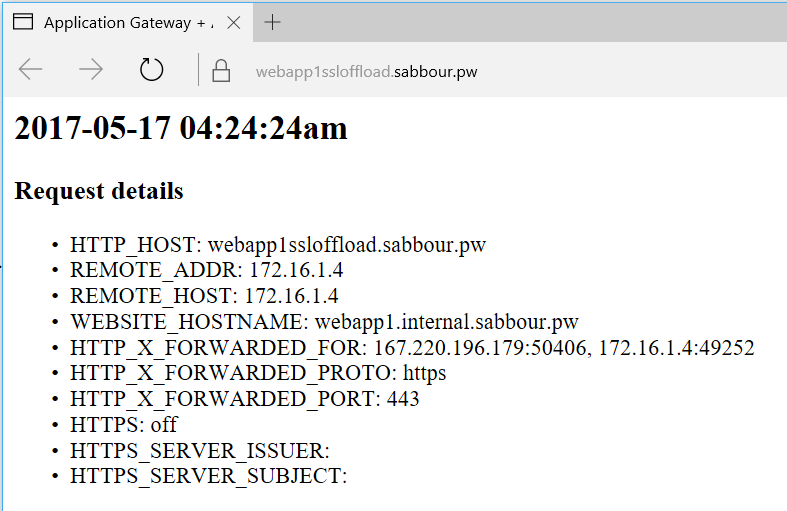
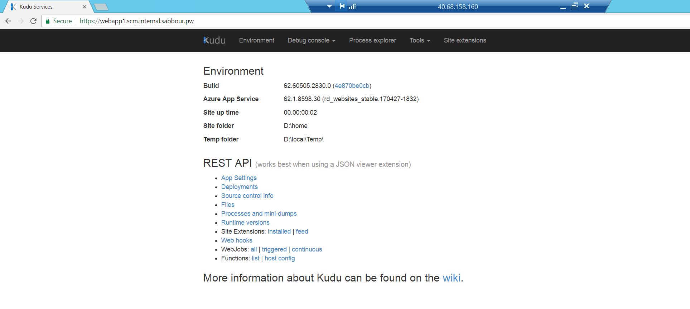

\# App Service Environment with an Internal Load Balancer and End-to-End SSL behind an Application Gateway
This template deploys an **App Service Environment + Application Gateway with End-to-End SSL** enabled with Web Application Firewall.

`Tags: Application Gateway, App Service Environment, Web Application Firewall, Web Apps`

## Deploy initial infrastructure
<a href="https://portal.azure.com/#create/Microsoft.Template/uri/https%3A%2F%2Fraw.githubusercontent.com%2Fsabbour%2Fappgw-aseilbssl%2Fmaster%2Fazuredeploy.json" target="_blank">

</a>

## Deploy additional Web App
<a href="https://portal.azure.com/#create/Microsoft.Template/uri/https%3A%2F%2Fraw.githubusercontent.com%2Fsabbour%2Fappgw-aseilbssl%2Fmaster%2Fazuredeploy-webapp.json" target="_blank">

</a>


## Solution overview and deployed resources



Note that this template assumes you will use Azure DNS to host your DNS. If you opt to host your domains elsewhere, please fork the template and comment out the relevant Azure DNS sections.

## Prerequisites

Before you deploy the template, you need to have your 2 SSL certificates around.
1. **Front-end SSL certificate:** This is the certificate that your end users will see in their browser. At minimum it should have **Subject= \*.domain.com**
2. **Back-end SSL certificate:** This is the certificate that will be used on the Internal Load Balancer. Your "internal" users will see this. At minimum it should have **Subject=\*.internal.domain.com and SAN=\*.scm.internal.domain.com** where **internal.domain.com** is your App Service Environment DNS suffix. It doesn't have to be from a root CA but it is recommended, otherwise users will see an SSL warning if they browse to the internal hostnames.


You can use the PowerShell scripts **Get-Base64FromPFX.ps1** to read the PFX certificate and convert it into Base64 encoded PFX (with private key) and CER (without private key) as well as spitting out the thumbprint.
You'll only need to do this for the Internal Load Balancer certificate.

## Deployment steps

+ You can click the "Deploy to Azure" button at the beginning of this document.
+ Supply the correct parameters for the certificates
+ This will take about 2-hours to deploy
+ Run the **Add-WebAppToAppGw.ps1**  PowerShell script to finish the process.



## Post deployment

+ Run the **Add-WebAppToAppGw.ps1** PowerShell script to finish the process. The script will provision the required listeners, certificates, probes, etc. in the Application Gateway as well as setting up the required Custom Domains in your Azure Web App in order to make this work.
+ You need to set the parameters as per your envionment
+ If you didn't change the **BackendAuthenticationCertificateName** in the ARM template, then this value should still be **ase-ilb-public-certificate**
+ For End-to-End SSL
```PowerShell
## End-to-End SSL
 .\Add-WebAppToAppGw.ps1
 -ResourceGroupName "rgname"
 -ApplicationGatewayName "appgw-name"
 -BackendPoolName "ase_pool"
 -BackendIPAddress "172.16.3.9"
 -BackendFQDN "webapp1.internal.domain.com"
 -WebappName "webapp1"
 -FrontendHost "webapp1endtoend"
 -FrontendRootZoneName "domain.com"
 -FrontendSSLCertificateName "domain.com-frontend-sslcertificate"
 -FrontendSSLCertificatePath "path\to\wildcard_domain_com.pfx"
 -BackendAuthenticationCertificateName "ase-ilb-public-certificate"
 -SSLEndToEnd
```
+ For SSL Termination on the Application Gateway
```PowerShell
## SSL Termination
 .\Add-WebAppToAppGw.ps1
 -ResourceGroupName "rgname"
 -ApplicationGatewayName "appgw-name"
 -BackendPoolName "ase_pool"
 -BackendIPAddress "172.16.3.9"
 -BackendFQDN "webapp1.internal.domain.com"
 -WebappName "webapp1"
 -FrontendHost "webapp1ssloffload"
 -FrontendRootZoneName "domain.com"
 -FrontendSSLCertificateName "domain.com-frontend-sslcertificate"
 -FrontendSSLCertificatePath "path\to\wildcard_domain_com.pfx"
 -SSLTermination
```

### Adding additional apps/domains to the environment
Every time you need to connect a Web App to the Application Gateway, you can run the **Add-WebAppToAppGw.ps1** PowerShell script to complete the configuration,

## Connecting to your App Service Environment
+ Once the environment is ready and the DNS propagates, open http://yourappname.domain.com and https://yourappname.domain.com, both should work and the latter should be using End-to-End SSL. Note that the **REMOTE_ADDR** is actually the IP of the Application Gateway.

+ End to End SSL:
	+ 

+ SSL Offloading:
	+ 

+ To access the Kudu console or FTP, they should be at the following endpoints. The FTP username/password are your Azure Subscription's deployment credentials. The username would be **yourappname\deploymentusername**
   + Kudu: **yourappname.scm.internal.domain.com**
   + FTP: **ftp.internal.domain.com**   
	

+ Since the ASE is running behind an Internal Load Balancer, you can't access the endpoints above from outside the Virtual Network. You can either:
   + Use the "jump box" Virtual Machine that was created the Virtual Network and use it to access those endpoints. The username and password are the same as the BIND DNS Virtual Machine.
   + Setup a Point-to-Site VPN connection to the Virtual Network and use it to get onto the network. More details here: https://docs.microsoft.com/en-us/azure/vpn-gateway/vpn-gateway-howto-point-to-site-resource-manager-portal
   + Setup a Site-to-Site/Express Route connection to the Virtual Network and use it to get onto the network. More details here: https://docs.microsoft.com/en-us/azure/vpn-gateway/vpn-gateway-howto-site-to-site-resource-manager-portal
