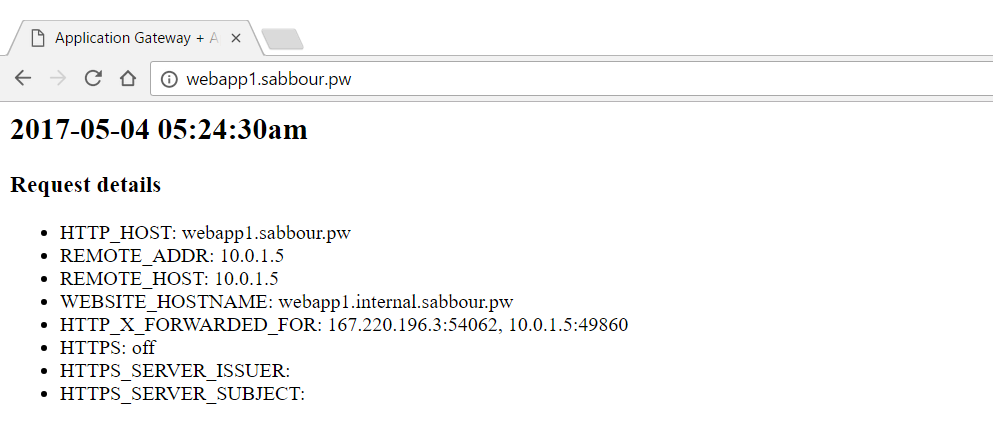
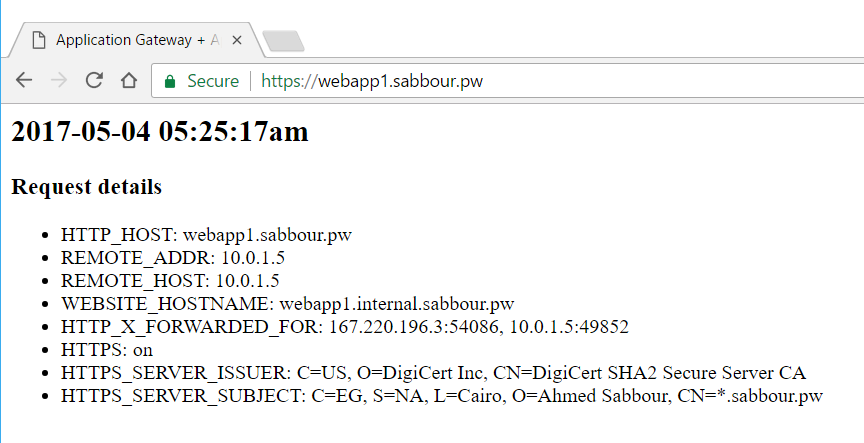

# App Service Environment with an Internal Load Balancer and End-to-End SSL behind an Application Gateway

<a href="https://portal.azure.com/#create/Microsoft.Template/uri/https%3A%2F%2Fraw.githubusercontent.com%2Fsabbour%2Fappgw-aseilbssl%2Fmaster%2Fappgw-aseilbssl%2Fazuredeploy.json" target="_blank">

</a>
<a href="http://armviz.io/#/?load=https%3A%2F%2Fraw.githubusercontent.com%2Fsabbour%2Fappgw-aseilbssl%2Fmaster%2Fappgw-aseilbssl%2Fazuredeploy.json" target="_blank">

</a>

This template deploys an **App Service Environment + Application Gateway with End-to-End SSL**.

`Tags: Application Gateway, App Service Environment`

## Solution overview and deployed resources

This is an overview of the solution

The following resources are deployed as part of the solution


#### Resource provider 1

Description Resource Provider 1

+ **Resource type 1A**: Description Resource type 1A
+ **Resource type 1B**: Description Resource type 1B
+ **Resource type 1C**: Description Resource type 1C

#### Resource provider 2

Description Resource Provider 2

+ **Resource type 2A**: Description Resource type 2A

#### Resource provider 3

Description Resource Provider 3

+ **Resource type 3A**: Description Resource type 3A
+ **Resource type 3B**: Description Resource type 3B

## Prerequisites

Before you deploy the template, you need to have your SSL certificate around.
You can use the powershell scripts below to convert the PFX (with private key) and CER (without private key) to Base64 text to add to the parameters.

```
$SecurePassword = Read-Host -AsSecureString  "Enter Certificate password"
$BSTR = [System.Runtime.InteropServices.Marshal]::SecureStringToBSTR($SecurePassword)
$certificatePassword = [System.Runtime.InteropServices.Marshal]::PtrToStringAuto($BSTR)
$cert = New-Object System.Security.Cryptography.X509Certificates.X509Certificate2("certificate.pfx",$certificatePassword)
[System.Convert]::ToBase64String($cert.GetRawCertData()) | Out-File "certificate.pfx.txt"
[System.Convert]::ToBase64String($cert.Thumbprint) | Out-File "certificate.pfx_thumbprint.txt"
```
```
$cer = New-Object System.Security.Cryptography.X509Certificates.X509Certificate2
$cer.Import("certificate.cer")
$bin = $cer.GetRawCertData()
[System.Convert]::ToBase64String($bin) | Out-File "certificate.cer.txt"
```

## Deployment steps

You can click the "Deploy to Azure" button at the beginning of this document.

## Post deployment

* You need to update the Backend Pool address in the Application Gateway with the App Service Environment ILB Virtual IP.


* Update your domain name's nameservers to the ones from the template outputs if you're using Azure DNS, or use either ApplicationGatewayPublicIp or ApplicationGatewayHostname to setup an A record or CNAME for your domain if you're hosting the DNS elsewhere.  


* After DNS propagates, open http://yourappname.yourdomain.com and https://yourappname.yourdomain.com, both should work and the latter should be using End-to-End SSL. Note that the **REMOTE_ADDR** is actually the IP of the Application Gateway.

